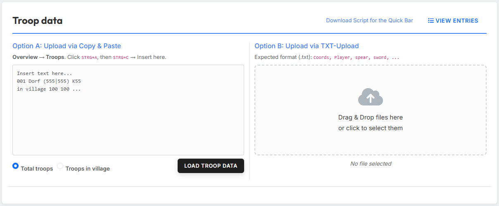
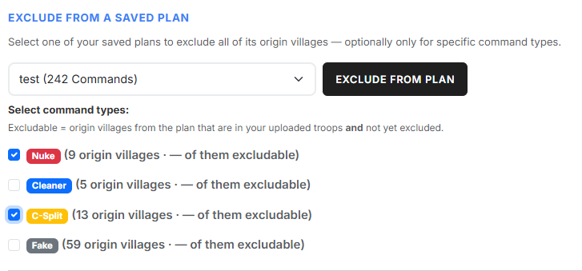
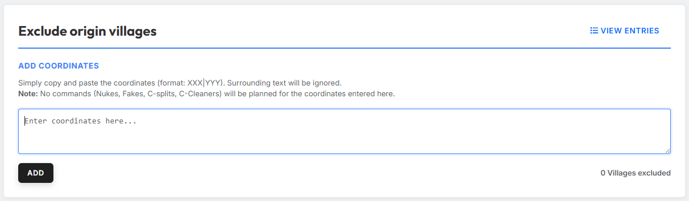
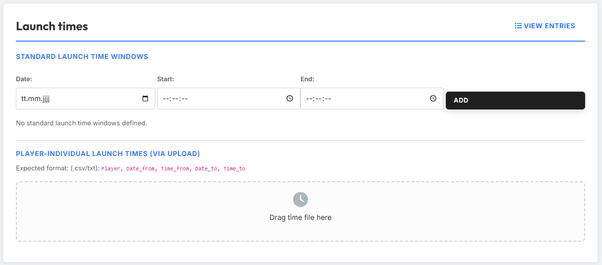
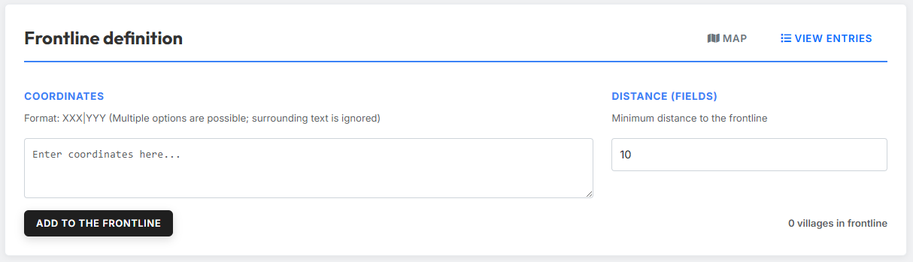
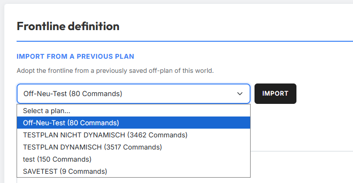
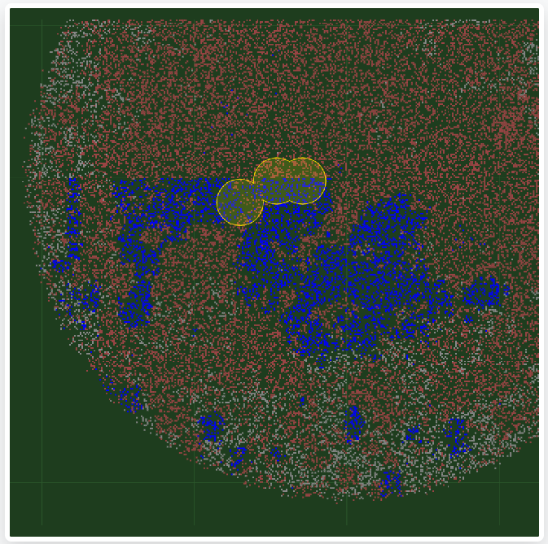
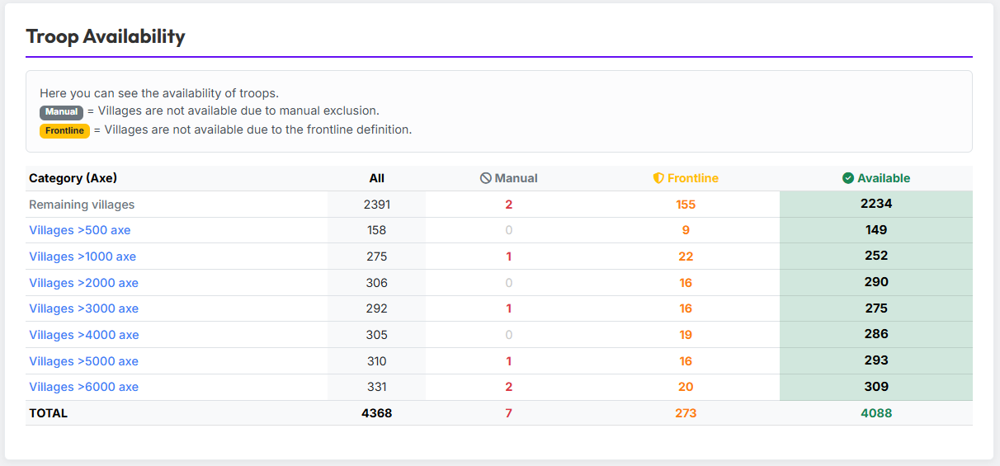

# Tab 1: Daten & Vorbereitung

In Tab 1 definierst du die grundlegenden Prämissen für die Planung.

## 1. Truppen importieren

{ .screenshot }

Im Bereich **„Truppendaten importieren"** lädst du die Truppen hoch, aus
denen das Tool die Offs verplanen soll. Es stehen zwei Wege zur Verfügung.

### Option A: Copy & Paste

Kopiere die Truppen aus der Ingame-Truppenübersicht (Strg+A, Strg+C) und
füge sie in das linke Textfeld ein. Über die beiden Radio-Buttons legst du
fest, welche Informationen aus der Truppenübersicht das Tool verwenden soll:

- **Gesamte Truppen** — die insgesamt vorhandenen Truppen (eigene + unterwegs).
- **Truppen im Dorf** — nur die aktuell im Dorf stehenden Truppen.

### Option B: TXT-Upload

Alternativ kannst du eine TXT-Datei in einem festen Format hochladen.
Diese Datei erzeugst du am bequemsten über das
[Schnellleisten-Script „Download Tribe Info"](https://forum.tribalwars.net/index.php?threads/download-tribe-info.285469/).

Erwartetes Format der Datei:

```
Coords,Player,spear,sword,axe,archer,spy,light,marcher,heavy,ram,catapult,knight,snob
483|520,Testuser A,2421,6099,100,5963,50,50,3632,200,5,279,0,8
543|538,Testuser A,100,100,6027,100,6,3014,100,100,159,5,0,0
467|559,Testuser A,3779,4836,100,4803,40,50,6309,1584,5,80,0,0
465|523,Testuser B,4298,5495,100,6752,23,50,5761,1131,5,35,0,0
468|515,Testuser B,721,4160,100,2280,61,50,5935,832,5,308,0,4
```

!!! info "Liste ansehen"
    Über den Button **„Liste ansehen"** kannst du dir die importierten
    Truppen jederzeit anzeigen lassen und prüfen.

## 2. Herkunftsdörfer ausplanen

Herkunftsdörfer kannst du auf zwei Wegen von der Planung ausschließen:
gezielt **aus einer gespeicherten Planung** — optional nur für bestimmte
Befehlstypen — oder durch **manuelle Eingabe** einzelner Koordinaten.

### Aus gespeichertem Plan ausplanen

{ .screenshot }

Im Bereich **„Aus gespeichertem Plan ausplanen"** schließt du alle
Herkunftsdörfer einer bereits gespeicherten Planung in einem Schritt aus.
Wähle dazu im Dropdown die gewünschte Planung aus — in Klammern siehst du
jeweils die Anzahl der enthaltenen Befehle.

Nach der Auswahl erscheint die Liste der im Plan enthaltenen
**Befehlstypen**, jeweils mit einem farbigen Badge zur schnellen
Unterscheidung. Hake die Typen an, deren Herkunftsdörfer du ausplanen
möchtest. Hinter jedem Typ steht, wie viele Herkunftsdörfer er enthält und
wie viele davon ausplanbar sind. Der Button **„Aus Plan ausplanen"** wird
erst aktiv, sobald mindestens ein Befehlstyp angehakt ist; ein Klick
übernimmt die Herkunftsdörfer der angehakten Typen in die Ausschlussliste.

!!! info "Was „ausplanbar" bedeutet"
    **Ausplanbar** sind nur Herkunftsdörfer, die im Plan enthalten sind, in
    deinen hochgeladenen Truppen vorkommen **und** noch nicht ausgeplant
    wurden. Lade daher zuerst deine Truppen hoch (Schritt 1) — andernfalls
    steht beim Zähler ein „—" statt einer Zahl.

### Manuelle Eingabe

{ .screenshot }

Im Bereich **„Koordinaten hinzufügen"** kannst du einzelne Dörfer von der
Planung ausschließen. Füge die Koordinaten in das Textfeld ein und klicke
auf **„Hinzufügen"**. Umgebender Text stört dabei nicht — das Tool erkennt
die Koordinaten automatisch.

Über den Button **„Liste ansehen"** kannst du alle ausgeplanten Dörfer —
egal ob manuell oder aus einem Plan ausgeplant — jederzeit einsehen und
verwalten.

!!! info "Keine Befehle aus ausgeplanten Dörfern"
    Für ausgeplante Herkunftsdörfer werden **keine** Befehle verplant —
    diese Dörfer werden vollständig von der Planung ausgeschlossen.

## 3. Abschickzeiten festlegen

{ .screenshot }

Im Bereich **„Abschickzeiten"** legst du fest, in welchen Zeitfenstern die
Befehle abgeschickt werden sollen. Es gibt drei Wege, Abschickzeiten zu
definieren.

### Typ 1: Standard-Abschickfenster

Im Bereich **„Standard-Abschickfenster"** gibst du Datum, Startzeit und
Endzeit ein und fügst das Fenster über **„Hinzufügen"** hinzu. Du kannst
mehrere Fenster nacheinander anlegen. Diese Standard-Fenster gelten für
alle Spieler, für die keine individuellen Zeiten hinterlegt sind.

### Typ 2: Aus Discord-Server importieren

Im Bereich **„Aus Discord-Server importieren"** kannst du die von deinen
Stammesmitgliedern bereits auf dem tw-utils-Discordbot gemeldeten
Abschickzeiten direkt in den Off-Planner übernehmen — ohne Umweg über
Export-Dateien.

**Voraussetzung:** Du musst auf mindestens einem Discord-Server die Rolle
`Leader` besitzen, und dieser Server muss auf die aktuell in tw-utils
ausgewählte Welt konfiguriert sein. Ist das nicht der Fall, ist der
Bereich zwar sichtbar, zeigt aber den Hinweis „Du hast keinen
Discord-Server mit Leader-Status für diese Welt." und der Button bleibt
deaktiviert.

**Bedienung:** Über die Checkbox-Liste wählst du einen oder mehrere
deiner Leader-Server aus. Per Klick auf **„Importieren"** zieht der
Off-Planner alle dort gemeldeten zukünftigen Zeitfenster und ordnet sie
den jeweiligen Spielern zu. Bereits hinterlegte individuelle Zeiten für
betroffene Spieler — egal ob aus früherem TXT-Upload oder vorigem
Discord-Import — werden dabei pro Spieler komplett überschrieben.
Spieler, für die in keinem der ausgewählten Server eine Meldung
vorliegt, behalten ihre bisherigen Zeiten.

Wie deine Stammesmitglieder ihre Abschickzeiten über den Discord-Bot
melden, ist hier beschrieben:
[Discord-Bot · Planning-System · Abschickzeiten](../discord-bot/planning-system.md#3-abschickzeiten).

!!! info "Wenn ein Spieler in mehreren Discord-Servern gemeldet hat"
    Sollte ein Spieler in mehreren ausgewählten Servern gleichzeitig
    Zeiten gemeldet haben, gewinnt pro Spieler die Guild mit der
    **jüngsten** Meldung — von dort werden dann alle seine Fenster
    übernommen, Meldungen aus den anderen Servern für denselben Spieler
    werden verworfen. In der Praxis ist dieser Konfliktfall selten,
    weil Spieler typischerweise nur in einer Guild aktiv ihre Zeiten
    pflegen.

### Typ 3: Spielerindividuelle Abschickfenster (per Upload)

Im Bereich **„Individuelle Zeiten (Upload)"** kannst du individuelle
Abschickzeiten pro Spieler hochladen. Die Spieler geben dir dazu ihre
persönlichen Zeiten, die du anschließend als strukturierte Datei (.csv
oder .txt) in das Tool lädst.

Erwartetes Format der Datei:

```
Testuser A,10.05.2026,10:00:00,10.05.2026,10:07:00
Testuser A,10.05.2026,12:00:00,10.05.2026,12:15:00
Testuser B,10.05.2026,11:30:00,10.05.2026,12:00:00
Testuser B,10.05.2026,17:15:00,10.05.2026,18:15:00
Testuser C,10.05.2026,10:00:00,10.05.2026,10:05:00
Testuser C,10.05.2026,12:00:00,10.05.2026,12:15:00
Testuser C,10.05.2026,17:00:00,10.05.2026,19:00:00
Testuser C,10.05.2026,21:00:00,10.05.2026,21:15:00
```

!!! info "Standard- vs. individuelle Abschickfenster"
    Standard-Abschickfenster und individuelle Abschickfenster schließen
    sich gegenseitig aus. Sind für einen Spieler individuelle Zeiten
    hinterlegt — egal ob über Discord-Import oder TXT-Upload — werden
    ausschließlich diese verwendet. Die Standard-Fenster gelten für
    diesen Spieler dann nicht.

!!! info "Alle individuellen Zeiten löschen"
    Am Ende des Bereichs **„Abschickzeiten"** findest du den Button
    **„Alle individuellen Zeiten löschen"**. Über ihn entfernst du in
    einem Schritt alle individuellen Zeitfenster, unabhängig davon, ob
    sie aus einem TXT-Upload oder einem Discord-Import stammen. Die
    Standard-Abschickfenster bleiben dabei unberührt.

!!! info "Liste ansehen"
    Über den Button **„Liste ansehen"** kannst du dir für jeden
    eingeplanten Spieler anzeigen lassen, welche Abschickzeiten gelten
    (Standard oder individuell). Der Button ist erst verfügbar, nachdem du
    Truppen importiert hast.

## 4. Frontlinie definieren

Die Frontlinie kannst du auf zwei Wegen festlegen: Du trägst die
Frontdörfer **manuell** ein oder du **importierst** sie aus einer bereits
gespeicherten Off-Planung dieser Welt.

### Manuelle Eingabe

{ .screenshot }

Im Bereich **„Frontlinie definieren"** legst du fest, welche Dörfer als
Frontdörfer gelten und damit bei der Verplanung von Offs ausgenommen
werden sollen. Füge dazu im Feld **„Koordinaten"** die Koordinaten ein,
die deine Frontlinie definieren, und gib unter **„Abstand (Felder)"** den
gewünschten Mindestabstand zur Frontlinie an. Klicke anschließend auf
**„Zur Frontlinie hinzufügen"**.

Der eingestellte Abstand erzeugt einen sogenannten **Frontbereich** rund um
die Frontlinien-Koordinaten. Aus diesem Frontbereich werden keine Offs
verplant — so bleiben Frontspieler mobil und können kurzfristig auf
Angriffe reagieren.

Über den Button **„Liste ansehen"** kannst du die eingetragenen
Frontlinien-Koordinaten jederzeit einsehen und bearbeiten.

### Aus vorheriger Planung importieren

{ .screenshot }

Statt die Frontlinie manuell einzugeben, kannst du sie aus einer früher
gespeicherten Off-Planung dieser Welt übernehmen. Wähle dazu im Bereich
**„Aus vorheriger Planung importieren"** im Dropdown die gewünschte Planung
aus — in Klammern siehst du jeweils die Anzahl der enthaltenen Befehle — und
klicke auf **„Importieren"**.

Die gespeicherte Frontlinie wird in deine aktuelle Planung übernommen und mit
bereits vorhandenen Frontlinien-Koordinaten zusammengeführt. Zur Auswahl stehen
nur Off-Planungen der aktuell gewählten Welt. Hat eine Planung keine gespeicherte
Frontlinie, wirst du darüber informiert.

### Kartenvisualisierung

{ .screenshot }

Über den Button **„Karte"** öffnest du eine Karte, auf der der erzeugte
Frontbereich gelb markiert ist. Alle Dörfer innerhalb des gelben Bereichs
werden nicht als Offs eingeplant. Die Karte hilft dir, deine Eingaben
visuell zu überprüfen.

## 5. Truppenverfügbarkeit

{ .screenshot }

Im Bereich **„Truppenverfügbarkeit"** siehst du auf einen Blick, wie viele
Offs das Tool tatsächlich verplanen kann. Die Tabelle zeigt:

- **Alle** — die insgesamt importierten Offs.
- **Manuell** — Offs, die durch Ausplanung von Herkunftsdörfern
  ausgeschlossen wurden (manuell oder aus einem gespeicherten Plan).
- **Frontlinie** — Offs, die aufgrund der Frontliniendefinition
  ausgeschlossen wurden.
- **Verfügbar** — die Offs, die nach allen Ausschlüssen für die Planung
  zur Verfügung stehen.

So hast du jederzeit eine klare Übersicht, welche Ressourcen für die
Off-Planung verfügbar sind.
