# Tab 2: Angriffsplanung

In Tab 2 verplanst du alle **scharf angelaufenen Ziele** — also Ziele, die
mit echten Offs angegriffen werden sollen. Es gibt drei Kategorien:
**AG-Spam**, **Kattern** und **Bunker brechen**. Begleitfakes zu diesen
scharfen Zielen werden ebenfalls hier definiert. Die Verplanung **reiner
Fakeziele** (Ziele, die ausschließlich Fakes erhalten) erfolgt separat in
[Tab 3: Fakeplanung](tab3-fakeplanung.md).

## 1. Ankunftszeitkorridor

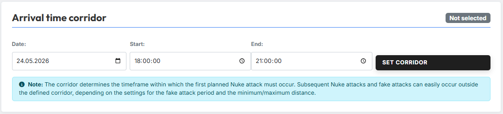{ .screenshot }

Im Bereich **„Ankunftszeiten-Korridor festlegen"** legst du den
Zeitrahmen fest, in dem die Angriffe eintreffen sollen. Gib **Datum**,
**Startzeit** und **Endzeit** ein und klicke anschließend auf
**„Korridor übernehmen"**, um den Korridor zu aktivieren.

!!! info "Korridor gilt nur für die 1. Off"
    Der Korridor bestimmt, in welchem Zeitrahmen die **1. geplante Off**
    eintreffen muss. Weitere Offs und Fakes können leicht außerhalb des
    festgelegten Korridors eintreffen — je nachdem, welche Einstellungen
    zum [Fake-Zeitraum](#9-festlegung-fake-zeitraum) sowie zum
    [Min-/Max-Abstand](#10-abstande-der-offs-und-kattasplits) getroffen
    wurden. Es empfiehlt sich daher, beim Festlegen des Korridors einen
    ausreichenden **Abstand zum Nachtbonus** einzuplanen.

## 2. Globale Einstellungen

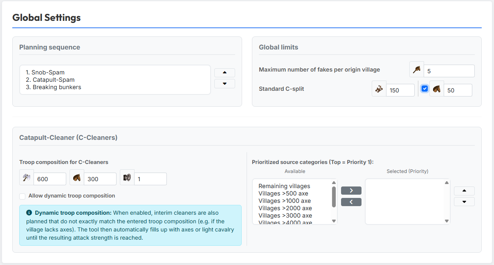{ .screenshot }

Im Bereich **„Globale Einstellungen"** legst du Einstellungen fest, die
für alle drei Kategorien gemeinsam gelten.

### 2.1 Planungsreihenfolge

Im Bereich **„Planungsreihenfolge"** sortierst du die drei Kategorien
(**AG-Spam**, **Kattern**, **Bunker brechen**) über die Buttons
**„Nach oben"** / **„Nach unten"** in die gewünschte Reihenfolge. Die
Reihenfolge bestimmt, in welcher Abfolge die Kategorien verplant werden.

!!! info "Reihenfolge ist bei knappen Ressourcen entscheidend"
    Bei knappen Off-Ressourcen werden die in der Planungsreihenfolge
    **zuerst** stehenden Kategorien vollständig bedient. Die **zuletzt**
    stehende Kategorie bekommt dadurch sehr wahrscheinlich nicht mehr
    alle erforderlichen Offs zugewiesen. Stelle die wichtigste Kategorie
    daher an die erste Position.

### 2.2 Globale Grenzwerte

Im Bereich **„Globale Grenzwerte"** legst du übergreifende Grenzwerte
fest:

- **„zulässige Anzahl Fakes pro Herkunftsdorf"** — wie viele Fakes
  insgesamt aus einem einzelnen Dorf verplant werden dürfen.
- **„Standard Kattasplit"** — die Standard-Einheitenanzahl eines
  einzelnen Katta-Splits.

### 2.3 Katta-Zwischencleaner

Im Bereich **„Katta-Zwischencleaner"** definierst du im Unterbereich
**„Truppenzusammensetzung"** die Standard-Truppen der Zwischencleaner:
**Axt**, **Lkav** und **Rammen**.

!!! info "Dynamische Truppenzusammensetzung"
    Ist die Option **„Dynamische Truppenzusammensetzung erlauben"**
    aktiviert, werden auch Zwischencleaner verplant, die **nicht exakt**
    der eingegebenen Truppenzusammensetzung entsprechen (z. B. wenn dem
    Dorf Äxte fehlen). Das Tool füllt dann automatisch mit Äxten oder
    Lkav auf, bis die resultierende Angriffsstärke erreicht ist. So
    lassen sich auch Dörfer als Cleaner einsetzen, die nicht perfekt
    der Soll-Zusammensetzung entsprechen.

Rechts daneben legst du im Bereich **„Priorisierte Quell-Kategorien"**
fest, aus welchen Dorf-Kategorien (z. B. *Dörfer >500 Axt*,
*>1000 Axt*, *>2000 Axt*, …, *Verbleibende Dörfer*) die Zwischencleaner
bevorzugt gestartet werden sollen. Verschiebe die gewünschten
Kategorien über die Pfeil-Buttons in die rechte Liste
**„Ausgewählt (Prio)"** und sortiere sie nach Priorität.

## 3. Die drei Standard-Kategorien

Das Tool kennt drei Kategorien scharfer Ziele:

- **AG-Spam**
- **Kattern**
- **Bunker brechen**

Für jede dieser Kategorien wird eine eigene Spalte angezeigt, in der du
Ziele und Befehlsstruktur unabhängig konfigurierst.

!!! info "Kategorienamen sind nur ein Vorschlag"
    Die Kategorien **AG-Spam** und **Kattern** sind hinsichtlich der
    Einstellungsmöglichkeiten **identisch aufgebaut** — nur die Kategorie
    **Bunker brechen** bietet leicht reduzierte Optionen. Du musst die
    Namen also nicht wörtlich nehmen: Du kannst die beiden Spalten z. B.
    auch nutzen, um **zwei unterschiedliche Katter-Aktionen** parallel
    zu planen. Die Bezeichnungen dienen lediglich als typischer
    Anwendungsfall, sind aber nicht zwingend.

## 4. Zielauswahl & Befehlsplanung – Übersicht

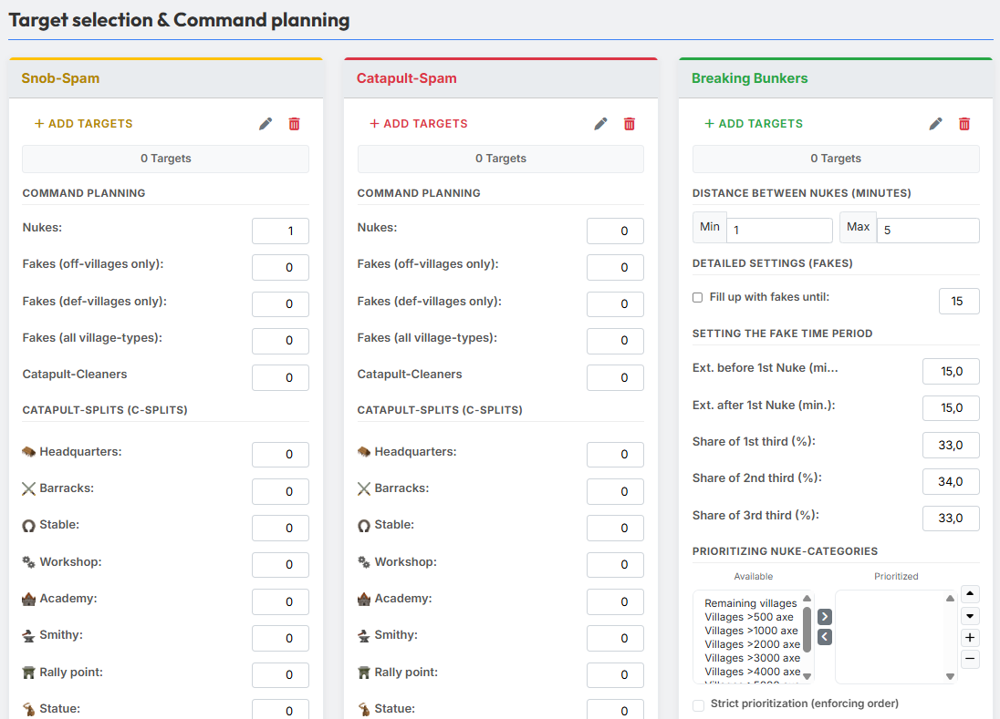{ .screenshot }

Im Bereich **„Zielauswahl & Befehlsplanung"** siehst du die drei
Kategorien nebeneinander als Spalten (AG-Spam, Kattern, Bunker brechen).
Pro Spalte stehen die gleichen Bedienelemente zur Verfügung:

- **„Ziele hinzufügen"** — öffnet das Modal zum Hinzufügen neuer Ziele.
- **Stift-Icon** — öffnet das Modal **„Liste bearbeiten"** zum
  Bearbeiten der vorhandenen Zielliste.
- **Mülltonnen-Icon** — löscht alle Ziele dieser Kategorie auf einmal.
- **Counter** — zeigt die aktuelle Anzahl Ziele in der Kategorie an.

Darunter folgen die kategoriespezifischen Befehls- und
Detail-Einstellungen, die in den nächsten Abschnitten beschrieben werden.

## 5. Ziele hinzufügen

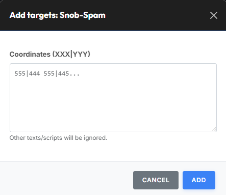{ .screenshot }

Über den Button **„Ziele hinzufügen"** öffnet sich das gleichnamige
Modal. Füge die **Koordinaten** der Zieldörfer im Format **XXX|YYY** in
das Textfeld ein — *„Andere Texte/Skripte werden ignoriert."* Bestätige
anschließend mit dem entsprechenden Hinzufügen-Button.

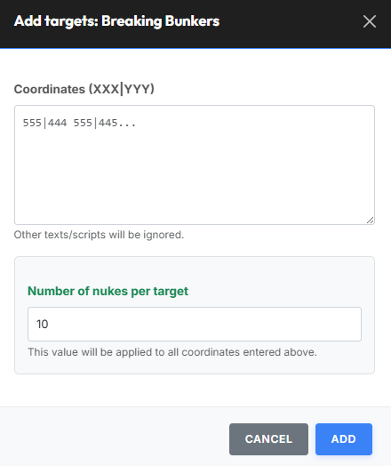{ .screenshot }

Für die Kategorie **Bunker brechen** gibt es zusätzlich das Feld
**„Anzahl Offs pro Ziel"**. Wie das Tool dort vermerkt, gilt: *„Dieser
Wert wird für alle oben eingegebenen Koordinaten übernommen."* So kannst
du bequem in einem Schritt eine ganze Liste Bunker mit einer
einheitlichen Anzahl Offs pro Ziel anlegen.

!!! info "Keine Duplikate"
    Das Tool stellt sicher, dass **über alle drei Kategorien hinweg
    keine scharfen Angriffsziele doppelt** enthalten sein können.
    Bereits in einer anderen Kategorie vorhandene Koordinaten werden
    beim Hinzufügen automatisch herausgefiltert.

## 6. Ziele bearbeiten

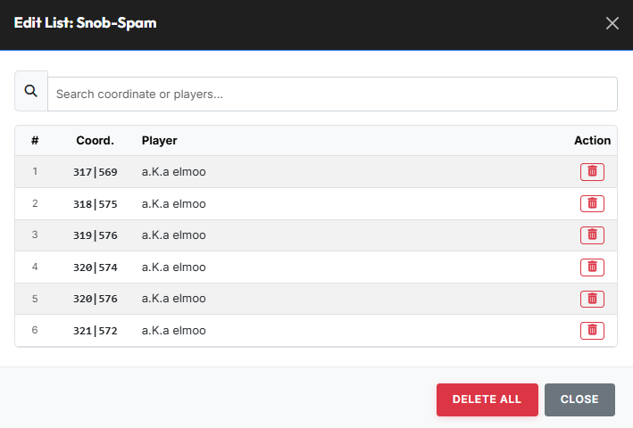{ .screenshot }

Über das **Stift-Icon** öffnet sich das Modal **„Liste bearbeiten"**.
Hier kannst du einzelne Ziele aus der Liste entfernen oder über
**„Alles löschen"** die gesamte Kategorie auf einmal leeren.

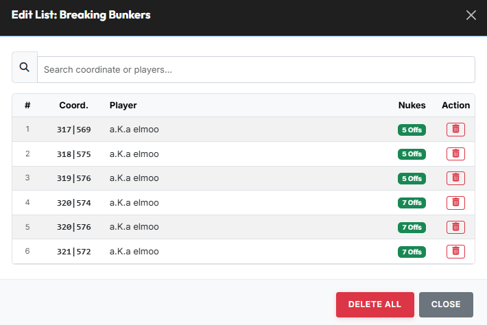{ .screenshot }

Bei der Kategorie **Bunker brechen** wird pro Ziel zusätzlich die
hinterlegte Anzahl Offs angezeigt.

## 7. Befehlsplanung pro Kategorie

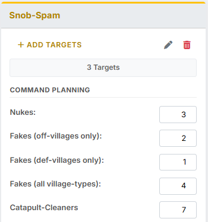{ .screenshot }

Im Bereich **„Befehlsplanung"** legst du pro Kategorie fest, **wie viele
Befehle pro Ziel** verplant werden sollen.

!!! info "AG-Spam und Kattern identisch — Bunker brechen reduziert"
    Die Befehlsplanung ist für die Kategorien **AG-Spam** und
    **Kattern** identisch aufgebaut. Die Kategorie **Bunker brechen**
    bietet eine **leicht reduzierte** Auswahl an
    Einstellungsmöglichkeiten — die Anzahl der Offs pro Ziel wird dort
    bereits beim [Hinzufügen der Ziele](#5-ziele-hinzufugen) festgelegt
    und entfällt daher in der Befehlsplanung.

Die folgenden Felder stehen pro Ziel zur Verfügung:

- **„Anzahl Offs"** — Anzahl scharfer Off-Angriffe pro Ziel.
- **„Fakes (aus Offdörfern)"** — Begleit-Fakes, die ausschließlich aus
  Off-Dörfern gestartet werden.
- **„Fakes (aus Deffdörfern)"** — Begleit-Fakes, die ausschließlich
  aus Deff-Dörfern gestartet werden.
- **„Fakes (Dorftyp egal)"** — Begleit-Fakes, die aus beliebigen
  Dörfern gestartet werden dürfen.
- **„Katta-Zwischencleaner"** — Anzahl Zwischencleaner pro Ziel (siehe
  Globale Einstellungen für die Truppenzusammensetzung).

!!! info "Begleitfakes ≠ Tab 3"
    Die hier definierten Fakes sind **Begleitfakes für die scharfen
    Ziele** dieser Kategorie. Die Planung **reiner Fakeziele** erfolgt
    separat in [Tab 3: Fakeplanung](tab3-fakeplanung.md).

## 8. Kattasplits (Gebäude)

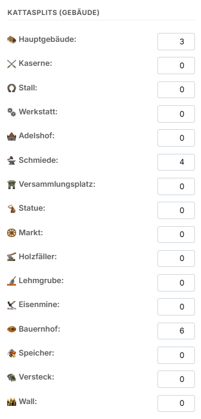{ .screenshot }

Im Bereich **„Kattasplits (Gebäude)"** legst du pro Gebäude fest, wie
viele Katta-Splits dort verplant werden sollen. Die hinterlegte Zahl
gibt an, wie viele **einzelne Splits** das Tool auf das jeweilige
Gebäude zu verplanen versucht.

Trägst du beispielsweise für das **Hauptgebäude** den Wert `3` ein,
versucht das Tool, **drei** Katta-Splits auf das Hauptgebäude zu
verplanen — und setzt für jeden dieser Splits jeweils die unter
[Globale Einstellungen → Standard Kattasplit](#22-globale-grenzwerte)
hinterlegte Standard-Einheitenanzahl an.

Welche Gebäude konkret auswählbar sind, hängt von der jeweiligen Welt ab.

## 9. Festlegung Fake-Zeitraum

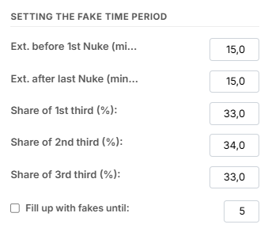{ .screenshot }

Im Bereich **„Festlegung Fake-Zeitraum"** definierst du das Zeitfenster
und die Verteilung der Begleitfakes rund um die 1. Off:

- **„Erw. vor 1. Off (Min.)"** — wie viele Minuten **vor** der 1. Off
  der Fake-Zeitraum beginnen darf.
- **„Erw. nach letzter Off (Min.)"** — wie viele Minuten **nach** der
  letzten Off der Fake-Zeitraum enden darf.
- **„Anteil 1. Drittel (%)"**, **„Anteil 2. Drittel (%)"**,
  **„Anteil 3. Drittel (%)"** — das gesamte Fake-Zeitfenster wird
  intern in **drei gleich große Zeitdrittel** geteilt. Hier legst du
  fest, welcher Anteil der Fakes prozentual in welches Drittel fällt.
  Damit steuerst du im Grunde, **an welcher Position innerhalb der
  Befehlsabfolge** die Begleitfakes überwiegend auftauchen — also ob
  sie eher **vor** den scharfen Offs eintreffen, sich **mit ihnen
  vermischen** oder erst **danach** folgen. Eine **gleichmäßige
  Verteilung** (z. B. 33/34/33) streut die Fakes über das gesamte
  Fenster; eine **ungleichmäßige Verteilung** (z. B. 50/30/20)
  konzentriert sie z. B. **vor** der 1. Off. Die drei Werte sollten in
  Summe 100 % ergeben.
- **„Mit Fakes auffüllen bis"** — die Anzahl an Befehlen, mit denen
  ein Ziel innerhalb dieser Kategorie möglichst **immer belegt** sein
  soll. Sinnvoll, wenn du möchtest, dass am Ende auf jedes Ziel
  **dieselbe Anzahl an Incs** geplant wird. Sollte ein Befehl (Off,
  Katta-Zwischencleaner oder Kattasplit) auf ein Ziel nicht verplant
  werden können, wird die fehlende Befehlszahl bei aktivierter Option
  mit **Fakes aufgefüllt** — sodass pro Ziel in dieser Kategorie am
  Ende trotzdem die gleiche Gesamtzahl an Befehlen erreicht wird.

## 10. Abstände der Offs und Kattasplits

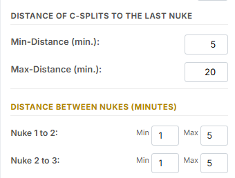{ .screenshot }

Im Bereich **„Abstand Kattasplits zur letzten Off"** legst du fest, wie
weit die Kattasplits zeitlich von der letzten Off entfernt eintreffen
sollen — mit den Feldern **„Min-Abstand (Min)"** und **„Max-Abstand
(Min)"**.

Im Bereich **„Abstände der Offs (Min.)"** steuerst du, wie eng oder
weit aufeinanderfolgende Offs auf einem Ziel **zeitlich
beieinanderliegen** sollen. Für jedes Paar aufeinanderfolgender Offs
gibst du jeweils einen **Min-** und **Max-Wert** in Minuten an:

- **Off 1 → 2** — Abstand der **2. Off** zur **1. Off**.
- **Off 2 → 3** — Abstand der **3. Off** zur **2. Off**.
- usw. — entsprechend für alle weiteren Offs.

**Beispiel 1 — Verteidigung wenig Reaktionszeit lassen:** Trägst du
für **Off 1 → 2** **Min = 1** und **Max = 5** ein, plant das Tool die
zweite Off so, dass sie zwischen **einer** und **fünf Minuten** nach
der ersten Off auf dem Ziel eintrifft. So vermeidest du, dass mehrere
Offs **exakt gleichzeitig** ankommen, und gibst der Verteidigung
gleichzeitig nur **wenig Reaktionszeit**.

**Beispiel 2 — Verspätungen beim Abschicken einplanen:** Großzügigere
Off-Abstände sind insbesondere dann sinnvoll, wenn du
**Nachlässigkeiten beim Abschicken** der Incs schon bei der Planung
berücksichtigen willst. Angenommen, du planst eine **Katta-Aktion**:
Pro Zieldorf sind **2 Offs** und **5 K-Splits** verplant, der
**Abstand der K-Splits zur letzten Off** wurde auf **3 Minuten**
gesetzt. Wenn nun der Abstand zwischen **1. und 2. Off** sehr gering
ist, kann es durch **verspätetes Abschicken** passieren, dass die
Offs **hinter den K-Splits** eintreffen. Setzt du den Abstand
**Off 1 → 2** stattdessen auf z. B. **10 Minuten**, würde die 1. Off
selbst bei **5 Minuten Verspätung beider Offs** noch sicher **vor**
den K-Splits eintreffen.

## 11. Priorisierung Off-Kategorien

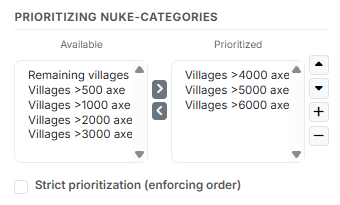{ .screenshot }

Im Bereich **„Priorisierung Off-Kategorien"** legst du fest, aus
welchen Herkunfts-Kategorien die Offs bevorzugt verplant werden sollen.
Verfügbare Kategorien sind z. B. *Dörfer >500 Axt*, *>1000 Axt*,
*>2000 Axt*, …, *>6000 Axt*. Verschiebe die
gewünschten Kategorien über die Pfeil-Buttons in die rechte Liste
**„Priorisiert"** und sortiere sie nach Priorität.

Die Checkbox **„Strikte Priorisierung (Reihenfolge erzwingen)"** legt
fest, wie die Priorisierung interpretiert wird:

- **Aus** — Aus den ausgewählten Off-Kategorien wird ein **einziger
  gemeinsamer Pool** gebildet, aus dem die Offs verplant werden. Die
  Reihenfolge in der priorisierten Liste hat dann keine Auswirkung auf
  die Verplanung.
- **Ein** — Die Priorisierung wird strikt eingehalten: Eine niedriger
  priorisierte Kategorie wird **erst dann** angefasst, wenn in der
  höher priorisierten Kategorie **keine validen Optionen** mehr
  gefunden werden konnten.

## 12. Zusammenfassung & Karte

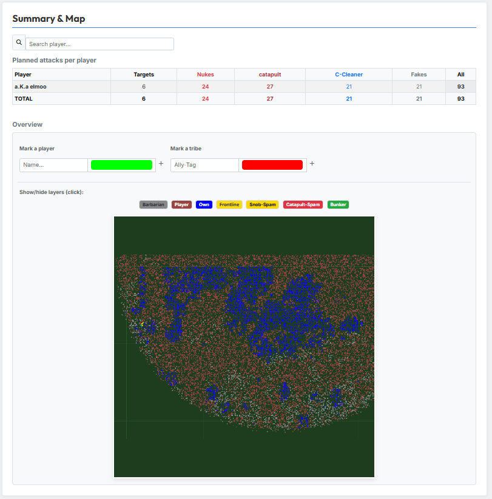{ .screenshot }

Im Bereich **„Zusammenfassung & Karte"** siehst du nach der Planung eine
Übersicht aller geplanten Angriffe.

Die Tabelle **„Geplante Angriffe pro Spieler"** zeigt pro Spieler die
Anzahl an **Ziele**, **Offs**, **Kattas**, **K-ZWC** (Katta-Zwischencleaner /
Cleaner), **Fakes** und **Gesamt** — sowie eine Summenzeile **Gesamt**.
Über das Suchfeld kannst du nach einzelnen Spielern filtern.

Darunter befindet sich der Bereich **„Visuelle Übersicht"**. Hier kannst
du über das Feld **„Spieler markieren:"** einzelne Spieler (Standard:
grün) und über das Feld **„Stamm markieren:"** einen ganzen Stamm
(Standard: rot) hervorheben.

Unter der Beschriftung **„Ebenen ein/ausblenden (Klick):"** lassen sich
auf der Karte die folgenden Layer ein- und ausblenden:
**Barbaren**, **Spieler**, **Eigene**, **Frontlinie**, **AG-Spam**,
**Kattern** und **Bunker**. So kannst du die Verteilung der geplanten
Angriffe visuell prüfen, bevor du in [Tab 3](tab3-fakeplanung.md) bzw.
[Tab 4](tab4-berechnung.md) weitermachst.
