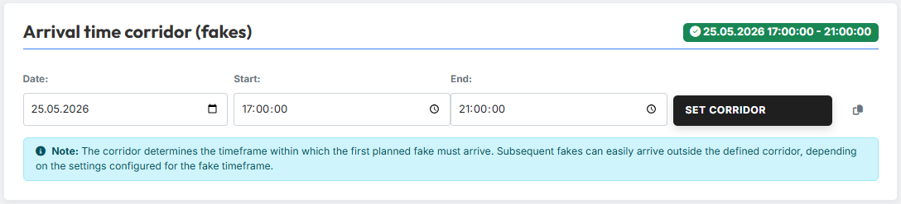
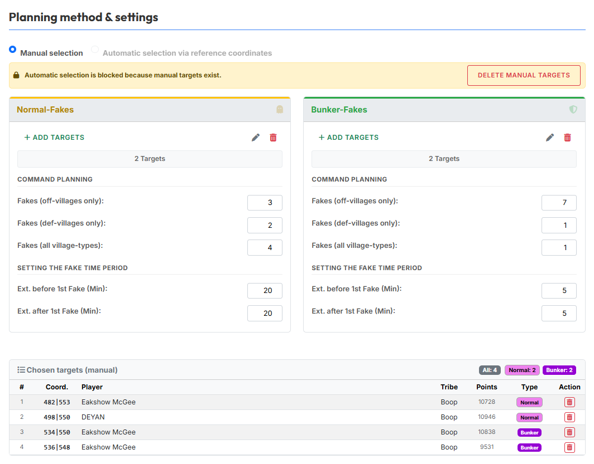
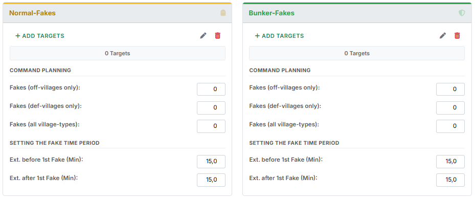
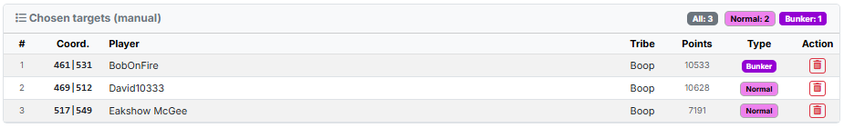
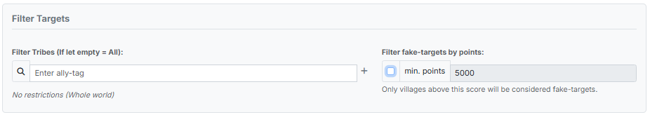
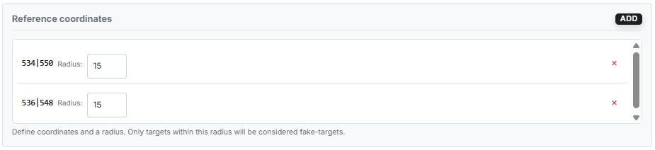
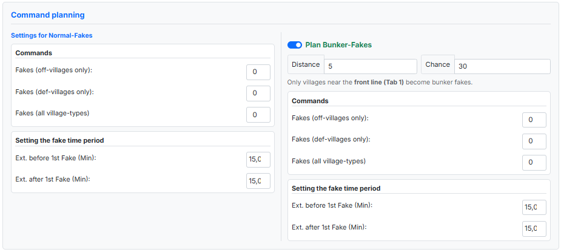
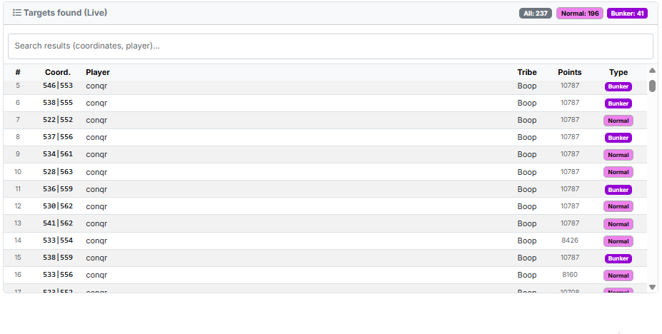
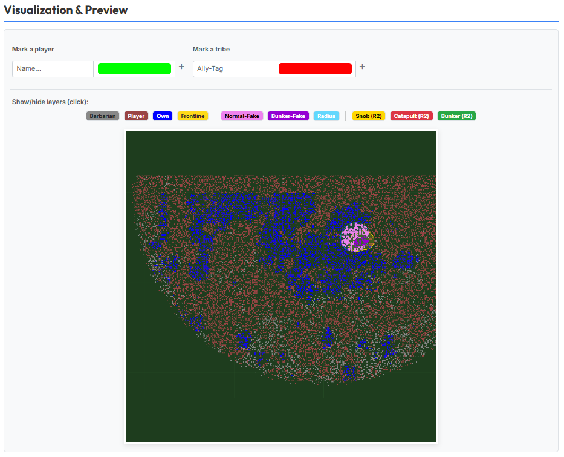

# Tab 3: Fakeplanung

In Tab 3 planst du alle **reinen Fakeziele** — also Ziele, die
ausschließlich Fakes erhalten und nicht mit scharfen Offs angelaufen
werden. Begleitfakes zu realen Zielen werden weiterhin in
[Tab 2: Angriffsplanung](tab2-angriffsplanung.md) zusammen mit den
dazugehörigen Offs, K-Splits und Zwischencleanern geplant.

## 1. Ankunftszeiten-Korridor

{ .screenshot }

Im Bereich **"Ankunftszeiten-Korridor festlegen (Fakes)"** legst du den
Zeitrahmen fest, in dem die Fakes ankommen sollen. **Datum**,
**Startzeit** und **Endzeit** eintragen und mit **Übernehmen**
bestätigen — Bedienung identisch zu
[Tab 2 §1](tab2-angriffsplanung.md#1-ankunftszeitkorridor).

Rechts neben dem Übernehmen-Button findest du zusätzlich einen kleinen
**Kopier-Button** mit dem Tooltip **"Aus Angriffen kopieren"**. Ein
Klick darauf übernimmt den in Tab 2 gesetzten Korridor in einem
Rutsch — Datum und Uhrzeiten müssen dann nicht erneut eingetragen
werden.

!!! info "Korridor gilt nur für den 1. Fake"
    Der Korridor legt fest, in welchem Zeitfenster der **1. geplante
    Fake** eintreffen muss. Weitere Fakes können je nach Einstellung
    im [Fake-Zeitraum (§4.3)](#43-befehlsplanung-pro-kategorie) leicht
    außerhalb des Korridors landen — es lohnt sich daher, einen
    ausreichenden Puffer zum Nachtbonus zu lassen.

## 2. Zwei Wege der Zielauswahl

Tab 3 bietet zwei grundsätzlich unterschiedliche Wege, Fakeziele
festzulegen:

- **Manuelle Auswahl** — du gibst die Koordinaten der Fakeziele selbst
  ein, ganz wie aus Tab 2 gewohnt.
- **Automatische Auswahl per Referenzkoordinaten** — das Tool sucht die
  Fakeziele anhand bestimmter Filterkriterien (Stamm, Punkte,
  Referenzkoordinaten mit Radius) selbstständig heraus.

Beide Wege schließen sich gegenseitig aus: sobald du in einem Modus
Ziele oder Filter angelegt hast, sperrt das Tool den jeweils anderen
Modus (siehe [§3 Planungsmethode wählen](#3-planungsmethode-wahlen)).

## 3. Planungsmethode wählen

{ .screenshot }

Im Abschnitt **"Planungsmethode & Einstellungen"** wählst du oben über
zwei Radio-Buttons den gewünschten Auswahlmodus:

- **Manuelle Auswahl**
- **Automatische Auswahl per Referenzkoordinaten**

!!! info "Modi schließen sich gegenseitig aus"
    Sobald in einem Modus Ziele oder Filter aktiv sind, sperrt das
    Tool den jeweils anderen Modus mit einem gelben Hinweisbanner.

    Erst nach Zurücksetzen des blockierenden Modus kann in den anderen
    gewechselt werden. So lassen sich beide Wege nicht versehentlich
    vermischen.

## 4. Manuelle Auswahl

In der manuellen Auswahl trägst du die Fakeziele selbst per
Koordinaten ein — das Vorgehen ist eng an Tab 2 angelehnt.

### 4.1 Die zwei Kategorien: Normal-Fakes & Bunker-Fakes

Das Tool kennt im manuellen Modus zwei Ziel-Kategorien:

- **Normal-Fakes**
- **Bunker-Fakes**

Jede Kategorie bekommt einen eigenen Eingabebereich mit Buttons zum
Hinzufügen/Bearbeiten von Zielen, einer eigenen Befehlsplanung und
einem eigenen Fake-Zeitraum.

!!! info "Kategorienamen sind nur ein Vorschlag"
    Die beiden Kategorien **Normal-Fakes** und **Bunker-Fakes** sind
    in ihren Einstellungen **strukturell identisch**. Die Namen
    spiegeln nur einen typischen Anwendungsfall wider, sind aber
    nicht bindend — du kannst die beiden Eingabebereiche genauso gut
    für **zwei beliebige parallele Fake-Aktionen** verwenden.

### 4.2 Ziele hinzufügen & bearbeiten

In jedem Kategorie-Eingabebereich stehen dieselben drei Bedienelemente wie aus
Tab 2 zur Verfügung: **Ziele hinzufügen** (öffnet das Modal zum
Eintragen), das **Stift-Icon** (öffnet die Liste der bereits
eingetragenen Ziele) und das **Mülleimer-Icon** (löscht alle Ziele
der Kategorie).

Bedienung und Modal-Verhalten sind identisch zum Vorgehen aus Tab 2 —
Details siehe dort:

- [Tab 2 §5: Ziele hinzufügen](tab2-angriffsplanung.md#5-ziele-hinzufugen)
- [Tab 2 §6: Ziele bearbeiten](tab2-angriffsplanung.md#6-ziele-bearbeiten)

!!! info "Keine Duplikate über Tabs hinweg"
    Ziele, die bereits in [Tab 2](tab2-angriffsplanung.md) als reale
    Angriffsziele verplant sind, werden beim Hinzufügen in Tab 3
    automatisch ausgefiltert. So kann kein Ziel doppelt verplant
    werden — weder innerhalb der beiden Tab-3-Kategorien noch
    tab-übergreifend mit Tab 2.

### 4.3 Befehlsplanung pro Kategorie

{ .screenshot }

Unter den Bedien-Buttons folgt pro Kategorie der Block
**"Befehlsplanung"** mit drei Eingabefeldern:

- **Fakes (aus Offdörfern):** — Anzahl Fakes, die ausschließlich aus
  Offensiv-Dörfern gestartet werden.
- **Fakes (aus Deffdörfern):** — Anzahl Fakes, die ausschließlich aus
  Defensiv-Dörfern gestartet werden.
- **Fakes (Dorftyp egal):** — Anzahl Fakes, die aus beliebigen
  Dorftypen gestartet werden dürfen.

Darunter folgt der Abschnitt **"Festlegung Fake-Zeitraum"** mit den
beiden Feldern:

- **Erw. vor 1. Fake (Min):** — wie viele Minuten **vor** dem 1. Fake
  der Fake-Zeitraum beginnen darf.
- **Erw. nach 1. Fake (Min):** — wie viele Minuten **nach** dem 1.
  Fake er enden darf.

Das Prinzip ist identisch zu
[Tab 2 §9: Festlegung Fake-Zeitraum](tab2-angriffsplanung.md#9-festlegung-fake-zeitraum)
— der Zeitraum bestimmt das Fenster, in dem die Fakes rund um den 1.
geplanten Fake-Einschlag herum verteilt eintreffen.

### 4.4 Übersichtstabelle "Gewählte Ziele (Manuell)"

{ .screenshot }

Unter den beiden Kategorie-Eingabebereichen zeigt die Tabelle
**"Gewählte Ziele (Manuell)"** alle eingetragenen Ziele auf einen
Blick — mit den Spalten **#**, **Koord.**, **Spieler**, **Stamm**,
**Punkte**, **Typ** (Badge **Normal** oder **Bunker**) und **Aktion**
(Löschen-Icon je Zeile).

Oben rechts findest du drei Zähler-Badges (**Alle: N**, **Normal: N**,
**Bunker: N**) als schnelle Übersicht über die Anzahl Ziele pro
Kategorie.

## 5. Automatische Auswahl per Referenzkoordinaten

Im automatischen Modus übernimmt das Tool die Zielsuche für dich —
du steuerst sie nur über Filterkriterien.

### 5.1 Grundidee

Sobald die automatische Auswahl aktiv ist, ist **per Default die
gesamte Welt** als potenzieller Fake-Ziel-Pool eingetragen. Du grenzt
diesen Pool dann schrittweise ein über:

1. **Ziel-Filter** (Stamm, Mindestpunkte) — siehe
   [§5.2](#52-ziel-filter)
2. **Zentren / Referenzkoordinaten mit Radius** — siehe
   [§5.3](#53-zentren-referenzkoordinaten)

Je nach gesetzten Filtern reduziert sich die Trefferliste live (siehe
[§5.5 Gefundene Ziele (Live)](#55-gefundene-ziele-live)).

!!! info "Keine Duplikate über Tabs hinweg"
    Auch im automatischen Modus filtert das Tool alle Ziele aus, die
    in [Tab 2](tab2-angriffsplanung.md) bereits als reale
    Angriffsziele verplant sind. So bleiben Tab-2- und Tab-3-Ziele
    garantiert disjunkt — kein Ziel wird doppelt verplant.

### 5.2 Ziel-Filter

{ .screenshot }

Im Bereich **"Ziel-Filter (Wo soll angegriffen werden?)"** stehen zwei
Filter zur Verfügung:

- **Stämme filtern (Leer = Alle):** — Eingabe eines oder mehrerer
  Stammes-Tags. Bleibt das Feld leer, zeigt der Status *"Keine
  Einschränkung (Ganze Welt)"* an und alle Stämme bleiben im Pool.
- **Punkte-Filter** mit Checkbox **"Min. Punkte"** + Eingabefeld —
  nur Dörfer **oberhalb** der angegebenen Punktzahl werden als
  Fake-Ziele berücksichtigt.

### 5.3 Zentren / Referenzkoordinaten

{ .screenshot }

Im Bereich **"Zentren / Referenzkoordinaten"** kannst du den
Suchradius geografisch eingrenzen. Über den Button **Hinzufügen**
öffnest du das Modal **"Zentrum hinzufügen"** und trägst dort eine
Koordinate sowie einen **Radius (Felder)** ein.

Mehrere Zentren sind möglich — jedes Zentrum ist ein eigener Kreis
mit eigenem Radius. Es werden alle Dörfer berücksichtigt, die in
mindestens einem dieser Kreise liegen.

Solange keine Zentren definiert sind, gilt der UI-Hinweistext:
*"Definiere Koordinaten und einen Radius. Nur Ziele in diesem Radius
werden angegriffen."*

### 5.4 Befehlsplanung & Intervalle

{ .screenshot }

Im Bereich **"Befehlsplanung & Intervalle"** stehen zwei Blöcke
nebeneinander.

**Linke Seite — Einstellungen (Normal-Fakes):** Die Befehlsplanung
für Normal-Fakes ist identisch aufgebaut wie im manuellen Modus —
also Felder *"Fakes (aus Offdörfern):"*, *"Fakes (aus Deffdörfern):"*
und *"Fakes (Dorftyp egal):"* plus *"Erw. vor / nach 1. Fake (Min):"*
unter **"Festlegung Fake-Zeitraum"**. Details siehe
[§4.3 Befehlsplanung pro Kategorie](#43-befehlsplanung-pro-kategorie).

**Rechte Seite — Bunker-Fakes:** Per Schiebeschalter
**"Bunker-Fakes planen"** lassen sich zusätzlich Bunker-Fakes
aktivieren. Diese werden **dynamisch** anhand der in
[Tab 1](tab1-daten.md) gesetzten **Frontlinie** ermittelt und über
zwei Parameter gesteuert:

- **Distanz** (Tooltip *"Max Distanz zur Frontlinie"*) — wie nah ein
  gegnerisches Dorf an der Frontlinie liegen muss, um überhaupt als
  potenzieller Bunker-Fake in Frage zu kommen.
- **Chance %** — die Wahrscheinlichkeit, mit der ein solches
  grenznahes Dorf tatsächlich als Bunker-Fake markiert wird.

Der UI-Hinweis darunter fasst das zusammen: *"Nur Dörfer nahe der
Frontlinie (Reiter 1) werden zu Bunker-Fakes."*

Unter dem Schiebeschalter folgen wie bei den Normal-Fakes eigene
Felder zur Befehlsplanung und zum Fake-Zeitraum für die Bunker-Fakes.

### 5.5 Gefundene Ziele (Live)

{ .screenshot }

Die Tabelle **"Gefundene Ziele (Live)"** zeigt das aktuelle Ergebnis
der Filterkette in Echtzeit — sobald du Filter, Zentren oder den
Bunker-Fake-Schalter anpasst, aktualisiert sich die Liste sofort.

Die Spalten entsprechen denen aus der manuellen Übersicht (**#**,
**Koord.**, **Spieler**, **Stamm**, **Punkte**, **Typ**). Über das
Suchfeld oberhalb der Tabelle kannst du gezielt nach Koordinaten oder
Spielernamen filtern. Die Zähler-Badges oben rechts (**Alle: N**,
**Normal: N**, **Bunker: N**) zeigen, wie viele Ziele aktuell pro
Kategorie im Pool sind.

## 6. Visualisierung & Vorschau

{ .screenshot }

Im Bereich **"Visualisierung & Vorschau"** kannst du die geplante
Fake-Verteilung auf der Weltkarte begutachten.

Über zwei Eingabefelder lässt sich gezielt ein Spieler oder Stamm
hervorheben:

- **Spieler markieren:** — Spielername eingeben, um diesen Spieler auf
  der Karte grün zu markieren.
- **Stamm markieren:** — Stammes-Tag eingeben, um den kompletten Stamm
  rot zu markieren.

Über die Button-Leiste **"Ebenen ein/ausblenden (Klick):"** lassen
sich beliebig viele Layer zu- und abschalten:

- **Barbaren**, **Spieler**, **Eigene** — die drei Dorftyp-Layer.
- **Frontlinie** — die in Tab 1 berechnete Grenze.
- **Normal-Fake**, **Bunker-Fake** — die in dieser Fakeplanung
  verplanten Ziele.
- **Radius** — die Reichweiten-Kreise der definierten Zentren /
  Referenzkoordinaten.
- **AG (R2)**, **Katta (R2)**, **Bunker (R2)** — die bereits in
  [Tab 2](tab2-angriffsplanung.md) verplanten realen Angriffsziele
  (*R2* = *Reiter 2*). So lassen sich Fakeziele und reale Ziele direkt
  nebeneinander auf einer Karte prüfen.

Nach erfolgreicher Fakeplanung geht es weiter mit der finalen
Berechnung in [Tab 4: Berechnung](tab4-berechnung.md).
