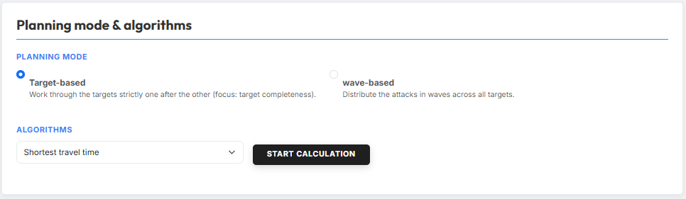
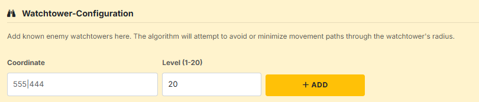
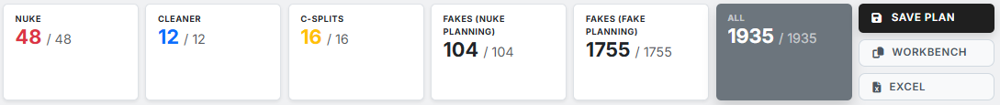
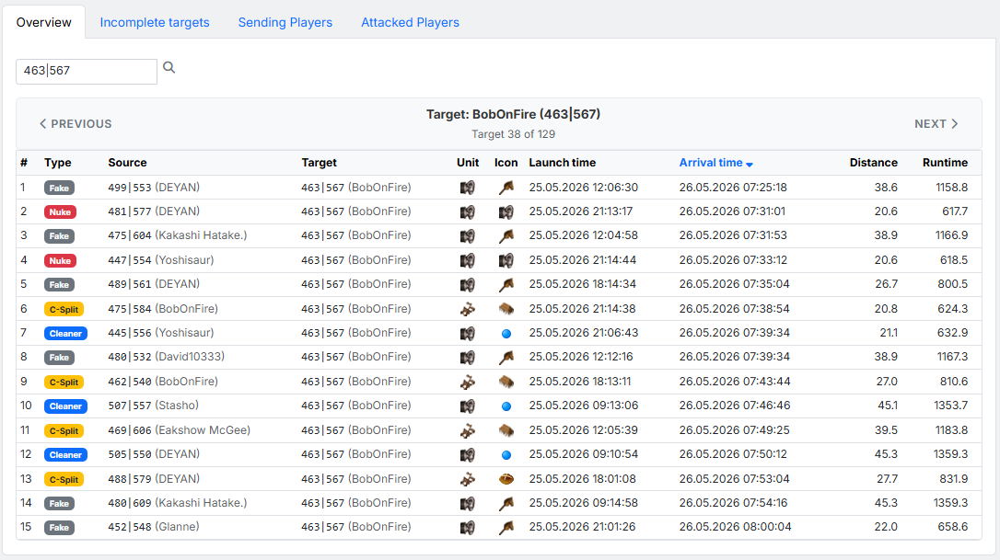
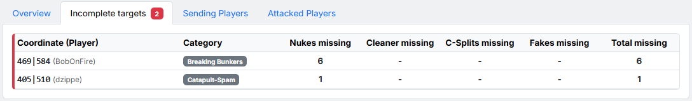
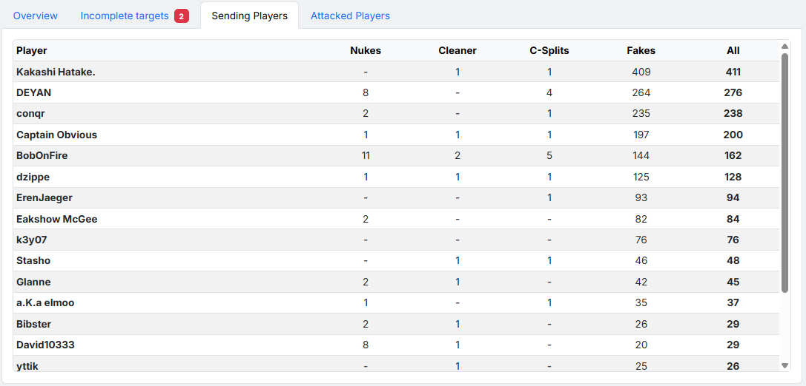
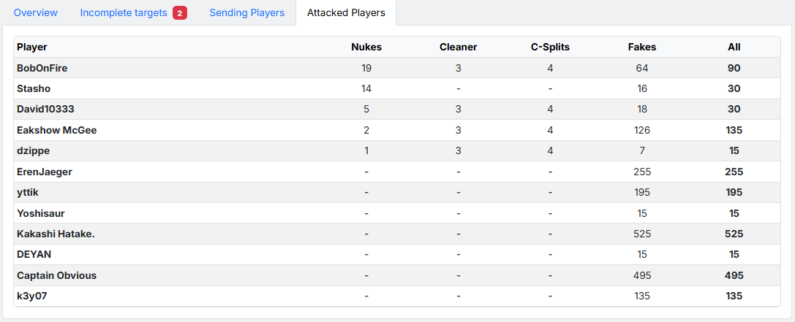

# Tab 4: Berechnung

In Tab 4 läuft die eigentliche **Berechnung des Off-Plans**. Aus den
in [Tab 1: Daten](tab1-daten.md), [Tab 2: Angriffsplanung](tab2-angriffsplanung.md)
und [Tab 3: Fakeplanung](tab3-fakeplanung.md) hinterlegten Daten und
Einstellungen wird hier ein konkreter Befehlsplan erzeugt. Anschließend
stehen das Planungsergebnis im **IST/SOLL-Vergleich** und die
Export-Funktionen (Plan speichern, Workbench-Befehle, Excel) zur
Verfügung.

## 1. Planungsmodus

{ .screenshot }

Im Bereich **"Planungsmodus & Algorithmen"** wählst du zuerst über zwei
Radio-Buttons, **wie** das Tool die Berechnung angeht:

- **Ziel-basiert** — *"Arbeitet die Ziele strikt nacheinander ab
  (Fokus: Ziel-Vollständigkeit)."* Das Tool plant ein Ziel komplett
  durch — erst wenn dieses Ziel die geforderten Offs, ZWC, K-Splits
  und Fakes erhalten hat, geht es zum nächsten weiter. Sinnvoll, wenn
  die Vollständigkeit jedes einzelnen Ziels wichtiger ist als eine
  gleichmäßige Verteilung über alle Ziele hinweg.
- **Wellen-basiert** — *"Verteilt die Angriffe in Wellen auf alle
  Ziele."* Statt Ziel-für-Ziel werden zuerst die jeweils 1. Befehle
  über alle Ziele verteilt, dann die jeweils 2. Befehle usw. Sinnvoll,
  wenn alle Ziele auf einem ähnlichen Versorgungsniveau landen sollen —
  auch wenn am Ende nicht zwingend jedes Ziel vollständig versorgt
  ist.

## 2. Algorithmus

Über das Dropdown **"Algorithmus"** wählst du, **nach welcher Strategie**
das Tool aus den möglichen Quell-Dörfern pro Ziel auswählt. Je nach
Planungsmodus stehen folgende Algorithmen zur Verfügung:

- **Wachturm-optimiert** — *"Versucht, Angriffe so zu planen, dass sie
  nicht durch bekannte Wachturm-Radien laufen."* Verfügbar nur auf
  Welten mit aktivem Wachturm. Bei Auswahl erscheint zusätzlich der
  Konfigurationsbereich (siehe [§2.1](#21-wachturm-konfiguration)).
- **Moral-optimiert** — bevorzugt aus dem Pool der möglichen
  Quell-Dörfer diejenigen mit hoher Moral.
- **Kürzeste Laufzeit** — wählt pro Ziel aus den möglichen Optionen
  das Quell-Dorf mit der kürzesten Reisezeit.
- **Längste Laufzeit** — wählt pro Ziel aus den möglichen Optionen
  das Quell-Dorf mit der längsten Reisezeit.
- **Zufällig** — wählt aus den möglichen Quellen zufällig aus.
  Nützlich, wenn keine spezifische Optimierung gewünscht ist oder der
  Plan möglichst unspezifisch wirken soll.
- **Knappheit-optimiert (Verteilung)** — *nur im Modus Wellen-basiert
  verfügbar.* Verplant zuerst diejenigen Quell-Dörfer, die es
  laufzeittechnisch zu den wenigsten Zielen schaffen würden.

Hat man eine Auswahl getroffen, startet man die Berechnung mit dem
Button **"Berechnung starten"** rechts neben dem Dropdown.

!!! info "Berechnung läuft im Hintergrund"
    Größere Pläne können einige Sekunden bis Minuten dauern. Während
    der Berechnung ändert sich der Button-Text z. B. auf
    *"Berechne… (0m 15s)"*. Die Seite während der Berechnung nicht
    schließen — der laufende Worker würde sonst abgebrochen.

### 2.1 Wachturm-Konfiguration

{ .screenshot }

Sobald als Algorithmus **"Wachturm-optimiert"** ausgewählt ist, blendet
das Tool zusätzlich den Bereich **"Wachturm-Konfiguration"** ein. Hier
hinterlegst du bekannte gegnerische Wachtürme; der Algorithmus
versucht anschließend, Laufwege durch deren Radien zu vermeiden oder
zu minimieren.

Pro Wachturm trägst du ein:

- **Koordinate** — Position des Wachturms im Format `XXX|YYY`.
- **Stufe (1-20)** — die Ausbaustufe; bestimmt den Wirkungsradius
  (Stufe 20 ≈ 15 Felder).

Mit **Hinzufügen** wird der Wachturm in die Liste übernommen.

Links unter den Eingabefeldern findest du die **Liste der hinterlegten
Wachtürme** mit Koord, Spieler und Stufe. Rechts daneben zeigt die
Karten-Vorschau **"Vorschau & Abdeckung"** die Wachtürme samt ihrer
Wirkungs-Kreise — so lässt sich visuell prüfen, wie viel der Karte
tatsächlich von feindlichen Wachtürmen abgedeckt ist.

## 3. Planungsergebnis

{ .screenshot }

Nach erfolgreicher Berechnung erscheint direkt unter dem
Berechnungsbereich das **Planungsergebnis** — eine Reihe von Karten im
**IST/SOLL-Vergleich** und drei Aktions-Buttons.

Jede Karte zeigt links das **IST** (was tatsächlich geplant werden
konnte) und rechts nach dem Schrägstrich das **SOLL** (was laut
Einstellungen geplant werden sollte). Welche Karten erscheinen, hängt
vom Plan ab — leere Kategorien werden ausgeblendet:

- **Off** — geplante reale Offs aus Tab 2.
- **ZWC** — geplante Zwischencleaner (Catapult-Cleaner) aus Tab 2.
- **K-Splits** — geplante Catapult-Splits aus Tab 2.
- **Fakes (Angriffsplanung)** — Begleitfakes für reale Ziele aus
  Tab 2.
- **Fakes (Fakeplanung)** — reine Fake-Befehle aus Tab 3.
- **Gesamt** — Summe aller Befehle (dunkelgrau hervorgehoben).

Stimmen IST und SOLL überein, ist der Plan vollständig. Liegt das IST
darunter, listet der Reiter
[§4.2 Unvollständige Ziele](#42-unvollstandige-ziele) auf, welche
Befehle für welche Ziele fehlen.

Rechts neben den Karten stehen drei Aktions-Buttons:

- **Plan speichern** — öffnet das Modal **"Plan speichern"**, in das
  du im Feld **"Name des Plans"** einen Namen einträgst und mit
  **Speichern** ablegst. Gespeicherte Pläne stehen anschließend im
  Plan-Viewer zur Verfügung.
- **WORKBENCH** — kopiert sämtliche Befehle als Workbench-Strings in
  die Zwischenablage. Im Spiel über das Workbench-Skript einfügen.
- **Excel** — lädt das komplette Planungsergebnis als Excel-Datei
  herunter (inklusive Discord-Import-Strings, Workbench-Strings,
  Quell-/Ziel-Spielern, Abschick- und Ankunftszeiten).

## 4. Detail-Reiter

Unterhalb der Aktions-Buttons folgen vier Reiter, die das
Planungsergebnis aus unterschiedlichen Perspektiven aufbereiten.

### 4.1 Übersicht

{ .screenshot }

Der Reiter **"Übersicht"** zeigt alle geplanten Befehle **pro Ziel**.
Über die Schaltflächen **"Vorheriges"** / **"Nächstes"** blätterst du
Ziel für Ziel durch; im Suchfeld oben links lässt sich per
Koordinaten-Eingabe (`123|456`) direkt zu einem bestimmten Ziel
springen.

Die Tabelle führt für das aktuelle Ziel sämtliche Befehle auf —
Spalten:

- **#** — laufende Nummer innerhalb des Ziels.
- **Typ** — Befehlstyp als Badge (Off, Fake, ZWC, K-Split, …).
- **Herkunft** — Quell-Koordinate und Quell-Spieler.
- **Ziel** — Ziel-Koordinate und Ziel-Spieler.
- **Einheit** — gewählte Anführer-Einheit.
- **Icon** — Befehls-Icon (z. B. Mörser, Doppelaxt).
- **Abschickzeit / Ankunftszeit** — Klick auf den Spaltenkopf
  sortiert die Befehle entsprechend.
- **Distanz** — Entfernung zum Ziel in Feldern.
- **Laufzeit** — Reisezeit der Einheit.

### 4.2 Unvollständige Ziele

{ .screenshot }

Der Reiter **"Unvollständige Ziele"** listet alle Ziele, für die das
Tool **nicht** alle geforderten Befehle planen konnte. Ein roter Badge
am Reiter-Namen zeigt die Anzahl der unvollständigen Ziele. Spalten:

- **Koordinate (Spieler)** — das unvollständige Ziel.
- **Kategorie** — aus welcher Kategorie das Ziel stammt (Snob-Spam,
  Catapult-Spam, Breaking Bunkers, Fakeplanung Normal/Bunker).
- **Offs fehlen / ZWC fehlen / K-Splits fehlen / Fakes fehlen** —
  wie viele Befehle des jeweiligen Typs noch fehlen.
- **Gesamt fehlen** — Summe der fehlenden Befehle.

Sind alle Ziele vollständig versorgt, zeigt der Reiter stattdessen die
grüne Erfolgsmeldung *"Alle Ziele sind vollständig."*.

### 4.3 Abschickende Spieler

{ .screenshot }

Der Reiter **"Abschickende Spieler"** zeigt, **welcher Spieler** wie
viele Befehle abschickt — absteigend sortiert nach Gesamt-Befehlen.
Spalten:

- **Spieler** — Name des abschickenden Spielers.
- **Offs / ZWC / K-Splits / Fakes** — Anzahl Befehle des jeweiligen
  Typs, die der Spieler abschickt.
- **Gesamt** — Summe aller Befehle des Spielers.

Hilfreich, um die Last gleichmäßig auf die Mitspieler zu verteilen und
Überlastung einzelner Spieler zu erkennen.

### 4.4 Angegriffene Spieler

{ .screenshot }

Der Reiter **"Angegriffene Spieler"** ist das Gegenstück dazu: er
zeigt, **welche gegnerischen Spieler** wie viele Befehle erhalten —
absteigend sortiert nach Offs. Die Spalten sind identisch zu §4.3
(Spieler, Offs, ZWC, K-Splits, Fakes, Gesamt), die Werte beziehen sich
hier aber auf den **angegriffenen** Spieler.
